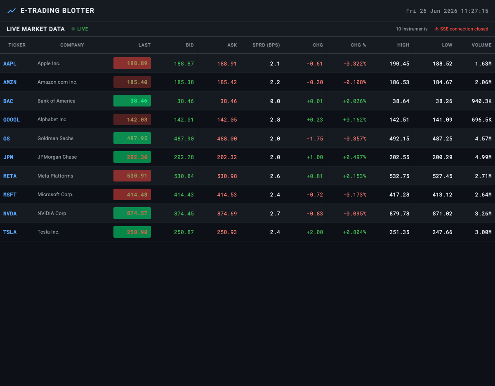

# E-Trading Blotter

<!-- CI / deployment status -->
[](https://github.com/StevenFewster/e-trading/actions/workflows/deploy.yml)
[](https://github.com/StevenFewster/e-trading/commits/main)

<!-- Core technologies -->
[](https://v15.angular.io/)
[](https://ngrx.io/)
[](https://rxjs.dev/)
[](https://www.typescriptlang.org/)
[](https://material.angular.io/cdk/categories)
[](https://material.angular.io/)

<!-- Architecture highlights -->
[](src/app/workers/stock-processor.worker.ts)
[](#stream-endpoint)
[](#key-design-decisions)

A real-time equity trading blotter built with **Angular 15**, **NgRx**, **RxJS**, and **Angular CDK**. Demonstrates a production-grade architecture for high-frequency market data ingestion and display.



## Features

- **Live blotter** — 10 instruments ticking at ~1000 updates/second, throttled to 10 UI frames/second via a Web Worker
- **CDK Table** — `<table cdk-table>` with sticky header and `trackBy` for minimal DOM churn
- **Price flash animations** — green/red cell flash on each tick direction change
- **Trade ticket** — click any row to open a live-ticking order panel with BUY / SELL buttons, quantity input, and estimated notional
- **NgRx Entity** — normalised store with O(1) upsert per symbol, one batch action per 100ms window
- **Web Worker** — data ingestion and throttling runs entirely off the main thread

---

## Getting started

### Prerequisites

- Node.js 16+ and npm 8+
- Angular CLI (optional — `npx` works without a global install)

### Run locally

```bash
npm install
npm start
```

Open [http://localhost:4200](http://localhost:4200). The dev server uses the `development` Angular configuration, which does **not** set a base href, so the app runs at the root path locally regardless of the production sub-path.

### Production build

```bash
npm run build
```

Output goes to `dist/etrading-blotter/`. The production config in `angular.json` sets `baseHref: /e-trading/` so asset paths and Angular Router resolve correctly when served from that sub-path.

---

## Deployment — stevenfewster.com/e-trading

### How it works

Pushes to `main` trigger the GitHub Actions workflow (`.github/workflows/deploy.yml`):

1. **Build job** — `npm ci` → `npm run build` (production, `baseHref=/e-trading/`) → copies `index.html` to `404.html` (SPA routing fallback) → uploads `dist/` as a workflow artifact
2. **Deploy job** — downloads the artifact → force-pushes to the `gh-pages` branch via `peaceiris/actions-gh-pages`

Pull requests only run the build job (no deploy), acting as a branch-protection gate.

```
feature/my-change  ──► PR to main ──► [build CI ✓] ──► merge
                                                            │
                                                     push to main
                                                            │
                                             [build] → [deploy → gh-pages]
                                                            │
                                                  stevenfewster.com/e-trading
```

### One-time GitHub setup

After the first successful workflow run, enable GitHub Pages on this repo:

1. Go to **Settings → Pages** in this repository
2. Set **Source** to `Deploy from a branch`
3. Set **Branch** to `gh-pages` / `/ (root)`
4. Save — GitHub will show the Pages URL (initially `StevenFewster.github.io/e-trading-example`)

Because `stevenfewster.com` is already the custom domain on your GitHub Pages user site (`StevenFewster/stevenfewster.github.io`), project repos are automatically accessible at `stevenfewster.com/<repo-name>`. If the repo is named `e-trading-example` the path will be `/e-trading-example`; rename the repo to `e-trading` for the exact `/e-trading` path.

### SPA routing on GitHub Pages

GitHub Pages serves static files only — navigating directly to `stevenfewster.com/e-trading/some-route` would 404 without the workaround. The workflow copies `index.html` → `404.html`; when Pages can't find a file it falls back to `404.html`, which loads Angular, which reads `window.location` and routes correctly.

---

## Architecture

```
src/app/
├── store/
│   ├── stock.model.ts          # Domain interfaces: Stock, StockUpdate, Order
│   ├── stocks/
│   │   ├── stocks.actions.ts   # Stream lifecycle + batch update + order actions
│   │   ├── stocks.reducer.ts   # NgRx Entity adapter, priceDirection derivation
│   │   ├── stocks.effects.ts   # Worker spawn, fromEvent → NgRx actions
│   │   ├── stocks.selectors.ts # selectAllStocks, selectStockBySymbol (memoised)
│   │   └── order.effects.ts    # Order submission side-effect
│   └── ticket/
│       ├── ticket.actions.ts   # openTicket / closeTicket
│       ├── ticket.reducer.ts   # activeSymbol state machine
│       └── ticket.selectors.ts # selectActiveSymbol, selectTicketOpen
├── workers/
│   └── stock-processor.worker.ts  # SSE connection + mock GBM generator + throttle
├── services/
│   ├── stock-seeds.ts          # Shared seed data (base prices)
│   └── order.service.ts        # Order submission (mock with simulated latency)
└── features/
    ├── blotter/                # CDK table blotter component
    └── ticket/                 # Trade ticket dialog component
```

### Data flow

```
/api/v1/data/stream (SSE)
  └─► stock-processor.worker   ← runs off main thread
        │  tick loop: ~1000/s per stock (Geometric Brownian Motion fallback)
        │  snapshot map: latest value per symbol, overwrites within window
        └─► postMessage every 100ms (throttle)
              └─► StocksEffects (fromEvent)
                    └─► batchUpdateStocks({ updates[] })
                          └─► stocksReducer (EntityAdapter.updateOne × N)
                                └─► selectAllStocks → BlotterComponent
                                └─► selectStockBySymbol → TicketComponent
```

### Key design decisions

| Concern | Approach | Why |
|---|---|---|
| High-frequency ingestion | Web Worker | Keeps main thread free for rendering |
| Throttling | Latest-value-wins at 100ms | SSE at 1000/s would saturate Angular CD |
| Batch action | One `batchUpdateStocks` per 100ms | One reducer call → one CD cycle for all 10 stocks |
| State shape | NgRx Entity `EntityState` | O(1) lookup by symbol; sorted by adapter |
| Selector memoisation | `selectStockBySymbol(symbol)` | Ticket re-renders only when its stock changes |
| Table rendering | `<table cdk-table>` | Header in `<thead>` — always structurally first |
| Price animation | CSS `@keyframes` + restart trick | No Angular Animations overhead per cell |
| OnPush everywhere | `ChangeDetectionStrategy.OnPush` | Skips CD unless Observable emits or input ref changes |

### Stream endpoint

The app connects to `/api/v1/data/stream` as a [Server-Sent Events](https://developer.mozilla.org/en-US/docs/Web/API/Server-sent_events) endpoint. Expected event payload:

```json
{
  "symbol": "AAPL",
  "price": 191.56,
  "bid": 191.54,
  "ask": 191.58,
  "volume": 5681058,
  "change": 2.06,
  "changePercent": 1.087,
  "high": 193.11,
  "low": 187.28,
  "timestamp": 1750939199000
}
```

If the endpoint is unavailable (404, CORS, network error) the worker falls back to a mock Geometric Brownian Motion generator after a 2-second timeout — so the app works standalone without a back-end.

### Order submission

Orders are POSTed to `/api/v1/orders`. In the mock implementation (no back-end), the `OrderService` simulates 150–350ms network latency and randomly rejects ~5% of orders to demonstrate error handling. Swap the mock for a real `HttpClient.post()` call in [order.service.ts](src/app/services/order.service.ts).

---

## NgRx DevTools

Install the [Redux DevTools](https://github.com/reduxjs/redux-devtools) browser extension to inspect every dispatched action and time-travel through state. The store is configured with `maxAge: 50` and `autoPause: true`.

---

## RxJS operators used

| Operator | Where | Purpose |
|---|---|---|
| `fromEvent` | `StocksEffects` | Worker `message` events → Observable |
| `merge` | `StocksEffects` | Seed action + live stream in parallel |
| `switchMap` | `StocksEffects`, `TicketComponent` | Cancel previous inner subscription on new outer emit |
| `takeUntil` | Throughout | Automatic teardown on `destroy$` |
| `distinctUntilChanged` | `AppComponent` | Prevent re-opening dialog on same symbol |
| `filter` | `AppComponent`, `TicketComponent` | Type-narrow nullable Observables |
| `interval` | `AppComponent` | Toolbar clock ticker |
| `of` | `StocksEffects`, `OrderService` | Wrap synchronous/mock values as Observables |
| `catchError` | Effects | Recover from worker / HTTP errors |
